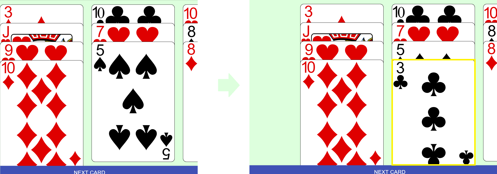
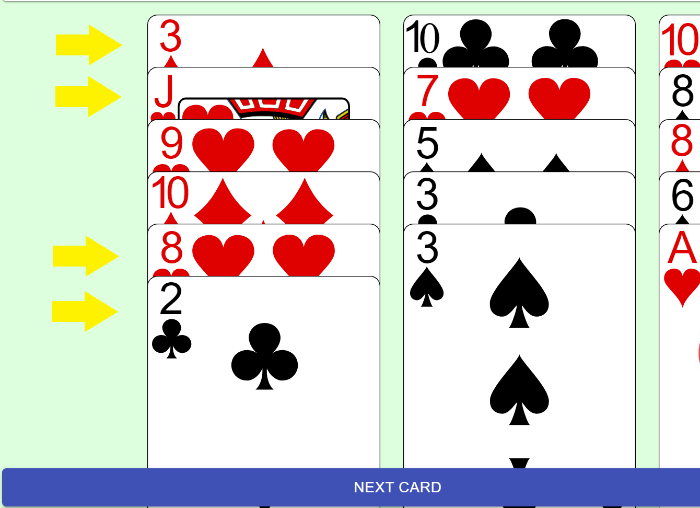

# 5 Stages - Poker Calculation Game

## Basic
Every card includes its value. For example, "5 of Hearts" represents 5, "Ace of Clubs" represents 1. 
All face cards repersent 10.

## Rules
There are two buttons: <b>Next Card</b> and <b>Delete Card</b>. 
The information board shows the current stage of the game. If click <b>Next Card</b>, it will draw the card from the deck and put it in the tail of the current stage 
</img> 
After the card is sent, player can pick three cards from the first two and the last two cards in the current stage. 
</img> 
If the sum of these three is divisible by 10, these three cards will put into the deck. For example, [J,8,2] can be picked because the sum equals 20. 
After the number of card in deck reaches 25, player have 5 chance of deleting the head card in a random stage. 
</img> 
Player can click <b>Delete Card</b> to delete the head card in a random stage. It costs 1 chance of deletion. 
If there is no card in the stage after players picking the cards or deletion, the stage will be cleared. 
If all stages are cleared, Player will win this game. 
If there is no card in deck, Player will lose this game. 
